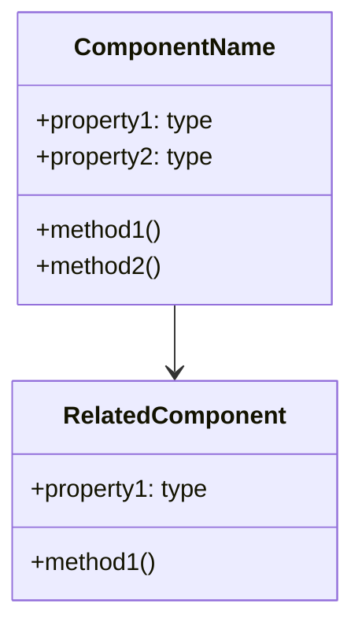
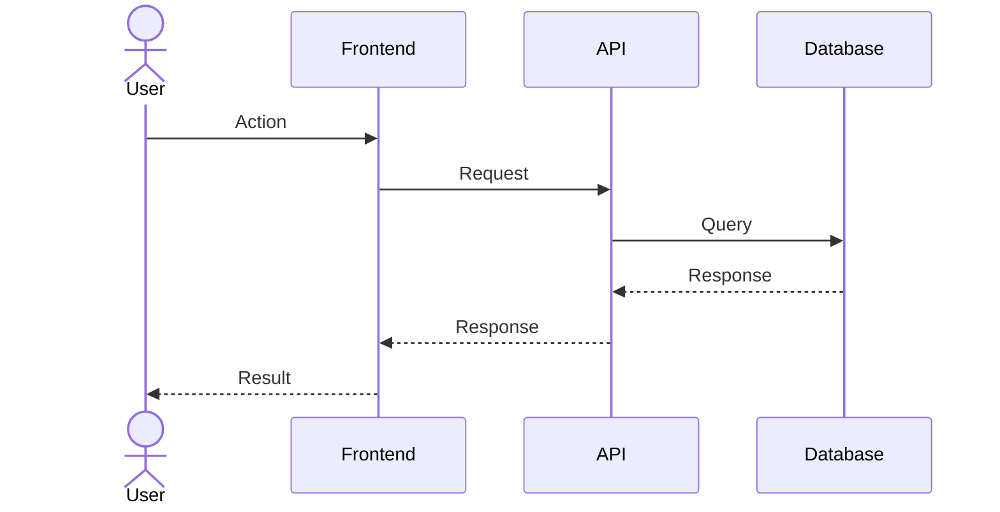
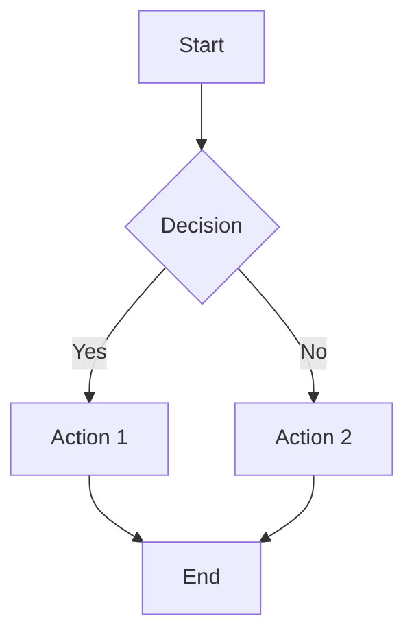
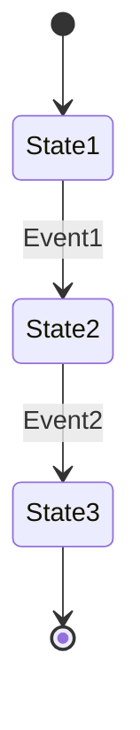
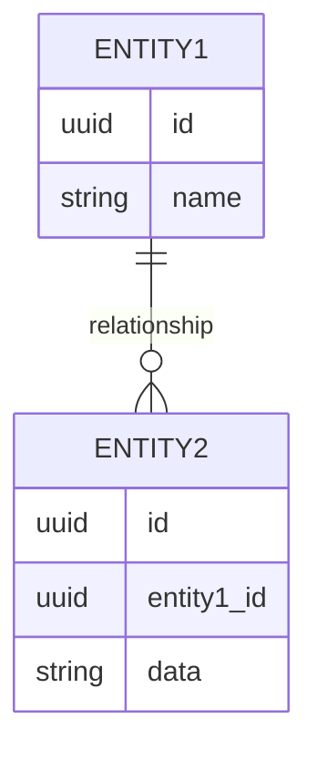

# TowTrace PR Mermaid Diagram Template

## PR Overview
Include a brief description of the PR here.

## Class/Component Diagram

## Sequence Diagram (For API/Flow Changes)

## Flow Diagram (For Business Logic)

## State Diagram (For Component States)

## ER Diagram (For Database Changes)

## How to Use This Template
1. Copy this template to your PR description
2. Replace the example diagrams with actual diagrams representing your changes
3. Remove any diagram types that aren't relevant to your PR
4. Update the diagrams to match your actual implementation

### Tips for Creating Effective Diagrams
- Keep diagrams focused on the specific changes in the PR
- Use clear, descriptive labels
- Include only relevant components and interactions
- Use colors to highlight key elements (where appropriate)
- Ensure relationships are accurately represented

For more information on Mermaid syntax, visit: [Mermaid.js Documentation](https://mermaid.js.org/)